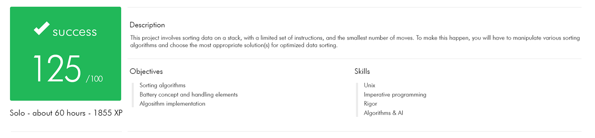

# push_swap

*Because Swap_push isn’t as natural*

This project will make you sort data on a stack, with a limited set of instructions, using the lowest possible number of actions. To succeed you’ll have to manipulate various
types of algorithms and choose the one (of many) most appropriate solution for an optimized data sorting.

## Statement
The game is composed of 2 stacks named a and b.

The stack a contains a random amount of negative and/or positive numbers which cannot be duplicated.

Stack b is empty

The goal is to sort in ascending order numbers into stack a, with the minimum possible number of operations.
During defence we’ll compare the number of instructions your program found with a maximum number of operations tolerated. If your program either displays a list
too big or if the list isn’t sorted properly, you’ll get no points.

To do this you have the following operations at your disposal:

| Operation | Description |
|:---:|:---|
| sa | swap a - swap the first 2 elements at the top of stack a. Do nothing if there is only one or no elements). |
| sb | swap b - swap the first 2 elements at the top of stack b. Do nothing if there is only one or no elements). |
| ss | sa and sb at the same time. |
| pa | push a - take the first element at the top of b and put it at the top of a. Do nothing if b is empty. |
| pb | push b - take the first element at the top of a and put it at the top of b. Do nothing if a is empty. |
| ra | rotate a - shift up all elements of stack a by 1. The first element becomes the last one. |
| rb | rotate b - shift up all elements of stack b by 1. The first element becomes the last one. |
| rr | ra and rb at the same time. |
| rra | reverse rotate a - shift down all elements of stack a by 1. The last element becomes the first one. |
| rrb | reverse rotate b - shift down all elements of stack b by 1. The last element becomes the first one. |
| rrr | rra and rrb at the same time. |

#### For bonus:

Write a program named checker, which will get as an argument the stack a formatted as a list of integers.

checker will then wait and read instructions on the standard input, each instruction will be followed by ’\n’. Once all the instructions have been read, checker will
execute them on the stack received as an argument.

If after executing those instructions, stack a is actually sorted and b is empty, then checker must display "OK" followed by a ’\n’ on the standard output. In every
other case, checker must display "KO" followed by a ’\n’ on the standard output

##

Enjoy!
