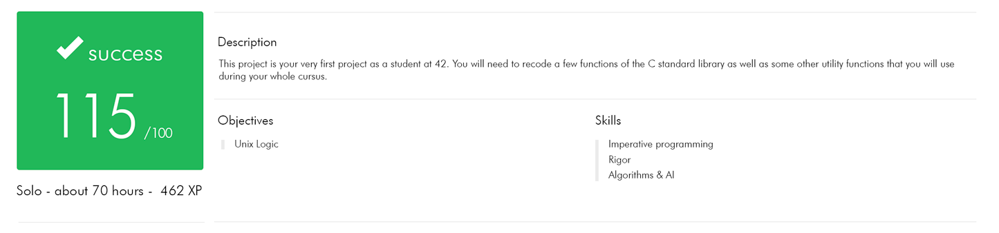

# libft
*My very first own library. Made for 42 Madrid.*

The aim of this project is to code a C library regrouping usual functions that you’ll be allowed to use in all your other projects.

## Usage
Use Makefile provided to compile.

**make**
Compile the original libft library

**make bonus**
Compile the original libft library + bonus files

**make fclean**
Clean objects and library

**make V=1**
Compile with all recipe lines printed

You have a detailed explanation for each function in the [document](./document.md)

Enjoy!
