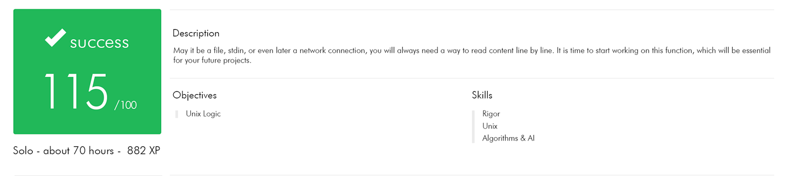

# get_next_line

*Reading a line on a fd is way too tedious. Made for 42 Madrid*

The aim of this project is to make you code a function that returns a line ending with a newline, read from a file descriptor.

## Statement
Calling your function get_next_line in a loop will then allow you to read the text available on a file descriptor one line at a time until the EOF.

It should behave well when it reads from a file and when it reads from the standard input.

Your program must compile with the flag -D BUFFER_SIZE=xx. which will be used as the buffer size for the read calls in your get_next_line. And the read() function must use the BUFFER_SIZE defined during compilation to read from a file or from stdin.

#### For bonus:

It should be made with a single static variable.

It should be able to manage multiple file descriptor. For example, if the file descriptors 3, 4 and 5 are accessible for reading, then you can call get_next_line once on 3, once on 4, once again on 3 then once on 5 etc. without losing the reading thread on each of the descriptors.

Enjoy!
