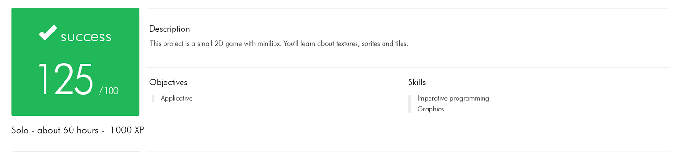

# So Long

*And thanks for all the fish!*

This project is a very small 2D game. It is built to make you work with textures, sprites. And some very basic gameplay elements.

## Statement

This project’s objectives are similar to all this first year’s objectives: Rigor, use of C, use of basic algorithms, information research etc.
As a graphic design project, so long will enable you to improve your skills in these areas: windows, colors, events, textures, etc.

You must use the miniLibX. Management of your window must remain smooth.

Your program must take as a first argument a map description file with the .ber extension. 
The 2D rectangular map will be constructed with 5 components player, map exits, walls, collectibles, and free space.

The player’s goal is to collect all collectibles present on the map then escape with minimal movement. Movements must be displayed. 

> This is a simple valid map:
1111111111111
10010000000C1
1000011111001
1P0011E000001
1111111111111

If any misconfiguration of any kind is encountered in the file, the program must exit properly and return "Error\n" followed by an explicit error message of your choice.

#### For bonus:

Enemy patrols that cause the player to lose in case of contact.

There’s some sprite animation.

Movement count is directly displayed on the screen instead of shell output.

##

Enjoy!
