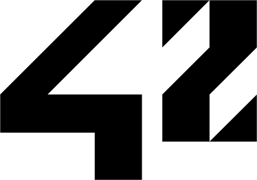

# 42_Cursus
42 is a private, nonprofit and tuition-free computer programming school created and funded in France in 2013. In addition to the two official campuses in Paris, France and Fremont, California, the school model was adopted also in Madrid, where I am studying.

## Common Circle
| Circle | Project | Language | Topics | Date of Completion |
|:---:|:---|:---:|:---|:---:|
| 1 | [__Libft__](./1_libft) | C | `library`, `Makefile`, `linked list` | 2020. 07. 27. |
| 2 | netwhat | - | `network`, `OSI protocols`, `TCP/IP` | 2020. 07. 30. |
|   | [__get_next_line__](./2_get_next_line) | C | `static variable`, `file descriptor` | 2020. 08. 12. |
|   | ft_printf | C | `variadic arguments`, `UTF-8`, `bitwise operation` | Working on it |
| 3 | ft_server | - | `docker`, `immutable infrastructure`, `server` | closed |
|   | cub3d | C | `Raycasting` | closed |
| 4 | libasm |  |  | closed |
|   | minishell |  |  | closed |
|   | ft_services |  |  | closed |
| 5 | CPP Module 01-08 |  |  | closed |
|   | Philosophers |  |  | closed |
| 6 | ft_irc |  |  | closed |
|   | webser |  |  | closed |
| 7 | ft_transcendence |  |  | closed |
